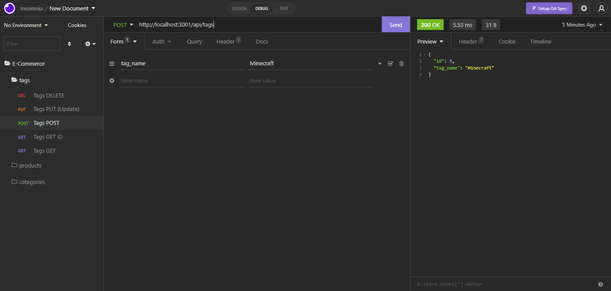

# E-Commerce Backend

  ## Description
  
  This application uses Sequelize, Express and MySQL2 to make changes to a database from API requests.

  ## Table of Contents

  - [Preview](#preview)

  - [Installation](#installation)

  - [Usage](#usage)

  - [Credits](#credits)

  - [License](#license)

  - [Contact Me](#contact)
  
  ## Preview

  
  
  Video of the application in use https://youtu.be/HMjYqWy9qJ8
  
  ## Installation
  
  In the terminal use "npm i" to download required modules
  
  ## Usage
  Make sure your .env file does not have ".EXAMPLE" on the end of it and in the .env file, insert your database username and password.

  If you do not already have a seeded ecommerce_db database, navigate to the 'db' file and run the code using your preffered SQL GUI. Once you have the database initialized, open the folder in terminal and run "npm run seed" and your database should now be seeded. I do these steps in the beginning of the video I provided.

  After you have the database, run nodemon or use "npm start" to start the server. Once the server is started you can use Insomnia, Postman or any app similar to start making API requests. I have examples of different API requests in the video I provided.
  
  ## Credits
  
  Jordan
  
  ## License
  
  
  
  ## Contact
  
  GitHub: jkstone321

  Email: jkstone321@gmail.com
